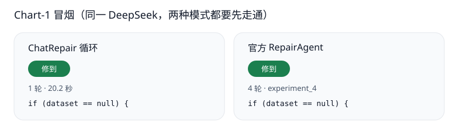
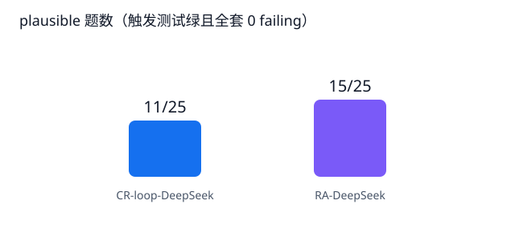
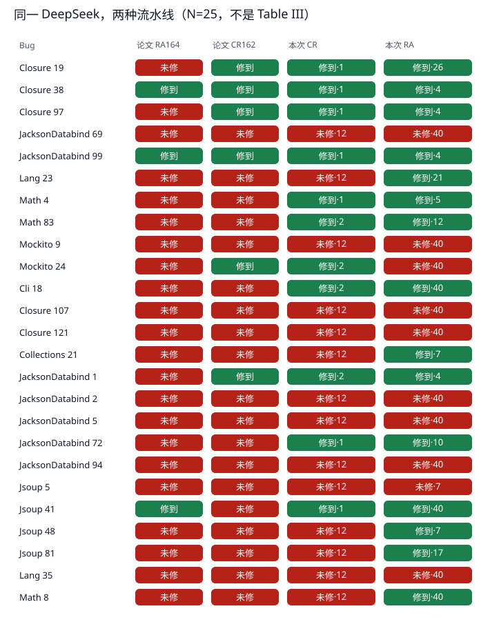
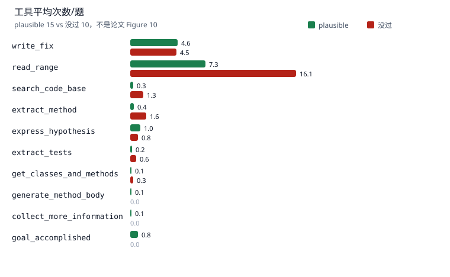
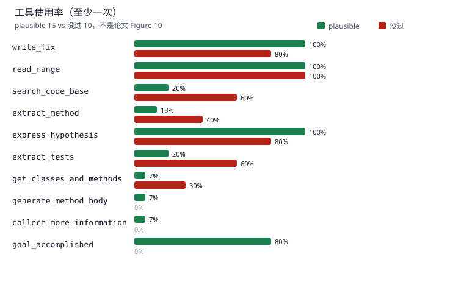

# RepairAgent 课程复现

同一模型、同一组 Defects4J 题，把官方 RepairAgent 和一条写死的修复循环并排放，看测试能不能从红变绿。

在抽到的 25 题上（DeepSeek `deepseek-chat`，temperature 0）：

| 流水线 | Plausible |
|--------|:---------:|
| **官方 RepairAgent**（不改 agent 逻辑，最多 40 cycle） | **15 / 25** |
| ChatRepair 风格循环（本仓库自写，最多 12 轮） | 11 / 25 |
| 先抽的 10 题 | 两边都是 7 / 10 |
| 后加的 15 题 | RA 8 / 15，循环 4 / 15 |

RepairAgent 测绿、循环没绿：Lang 23、Collections 21、Jsoup 48、Jsoup 81、Math 8。反过来只有 Mockito 24。

> 课程项目，对应 Bouzenia, Devanbu, Pradel, *RepairAgent: An Autonomous, LLM-Based Agent for Program Repair*（ICSE 2025，[arXiv:2403.17134](https://arxiv.org/abs/2403.17134)，DOI `10.1109/ICSE55347.2025.00157`，[官方仓库](https://github.com/sola-st/RepairAgent)）。论文在 Defects4J 全量 835 题上用 GPT-3.5 报出 plausible 186、correct 164。本仓库没有重跑那张表。

课上直接打开 [`evidence/compare_sample10/compare.html`](evidence/compare_sample10/compare.html)。

## 和论文对照

| | 论文 | 本仓库 |
|---|---|---|
| 模型 | GPT-3.5-0125 | DeepSeek `deepseek-chat`，OpenAI 兼容接口，temperature 0 |
| 数据 | Defects4J 全部 835 题（v1.2 的 395 + v2 的 440） | 官方 batches 去重后 `random.seed(42)` 抽 25 题；Chart-1 另作冒烟 |
| Agent | 动态 prompt + 14 个工具 + 状态机，默认 40 cycle | 官方 `repairagent.py`，`--model deepseek-chat --temperature 0 --max-cycles 40`，不改逻辑 |
| 对照 | 作者提供的 ChatRepair（162）、ITER（57）、SelfAPR（110）补丁 | 自写硬编码循环，给定 perfect FL，最多 12 轮 |
| 成功标准 | plausible：测试全过。correct：与开发者补丁语法相同，或人工判定语义一致（164 = 116 精确 + 48 语义） | 只做到 plausible：触发测试先绿，再 `defects4j test` 全套 0 failing |
| 定位 | 默认 perfect fault localization | perfect FL（`data/buggy-lines`） |
| 停止 | 模型调用 `goal_accomplished`，或用满 40 cycle。测绿本身不会停 | 同一条规则。Cli 18 测绿后仍把 `write_fix` 写到 30 次以上 |
| 成本（RQ2） | 约 27 万 token / 题，GPT-3.5 当时约 14 美分；中位时间 920 秒，99% 花在工具上，主要是跑测试 | $0 验收不调用模型。对比实验的花费取决于自己的 DeepSeek key |
| 消融与迁移 | RQ3 在 100 题上做了搜索工具、状态机、长期记忆、GZoltar；另有 GitBug-Java 100 题 | 没做 |

12 轮是这条课堂循环的失败上限。论文里的 ChatRepair 是 100–200 次尝试。两边的「一轮」也不是同一个单位：循环每一轮都要出补丁，RepairAgent 的一个 cycle 只是一次 LLM 查询，可以是读文件。

## 它怎么工作

论文 Figure 1：中间件拿着动态 prompt 问 LLM，LLM 回一个工具调用，中间件执行工具并把输出写回下一轮 prompt。一个 cycle 就是这一圈，也就是一次 LLM 查询。

```
                     RepairAgent
                     ===========

  +---------------------------------------------------------------+
  |                      LLM agent                                |
  |                                                               |
  |   Understand  --->  Collect information  --->  Try to fix     |
  |   the bug           to fix the bug              the bug       |
  |   extract_tests     search_code_base            write_fix     |
  |   express_hypothesis extract_method             read_range    |
  |                     find_similar_api_calls                    |
  |         ^                                              |      |
  |         |         discard_hypothesis / 测试没过         |      |
  |         +----------------------------------------------+      |
  |                                                               |
  |   Done  <---  goal_accomplished                               |
  +---------------------------------------------------------------+

  输入: Defects4J 的 buggy 版本 + 失败测试
  输出: 通过全部测试的补丁（plausible）
```

状态机（论文 Figure 2）限制当前能用哪些工具，不规定调用顺序。三态之后是 Done：

- **Understand the bug**：读失败测试和定位，用 `express_hypothesis` 写下对 bug 的判断，然后进入下一态。
- **Collect information**：`search_code_base`、`extract_method`、`read_range` 等，找能写进补丁的代码。
- **Try to fix**：`write_fix` 按 JSON 改代码并跑测试。失败会把改动撤掉。测绿之后如果模型不调用 `goal_accomplished`，就继续留在这一态，cycle 照样扣。

14 个工具分四组（论文 Table II）：

| 组 | 工具 |
|---|---|
| 读代码 | `read_range`，`get_classes_and_methods`，`extract_method`，`extract_tests` |
| 搜索 / 生成 | `search_code_base`，`find_similar_api_calls`，`generate_method_body` |
| 测试 / 补丁 | `run_tests`，`run_fault_localization`，`write_fix` |
| 控制状态 | `express_hypothesis`，`collect_more_information`，`discard_hypothesis`，`goal_accomplished` |

`write_fix` 自己会跑测试套件，所以单独的 `run_tests` 很少出现。论文 RQ4 里它是用得最少的工具；我们这 25 题上的调用次数是 0。`write_fix` 默认还会让模型再采样多个变体（论文默认 30 个），去重后逐个跑测试。

对照侧没有接 Xia 的 ChatRepair。`scripts/chatrepair_loop.py` 按论文第 I、II 节那种固定反馈环写的：把 buggy 行放进 prompt，生成补丁，跑测试，把失败信息贴回去。

## 目录

- [结果](#结果)
- [不花钱先验收](#不花钱先验收)
- [复跑对比](#复跑对比)
- [仓库里有什么](#仓库里有什么)
- [范围](#范围)
- [引用](#引用)

## 结果

数字底稿：[`evidence/compare_sample10/RESULTS.md`](evidence/compare_sample10/RESULTS.md)、[`TOOLS.md`](evidence/compare_sample10/TOOLS.md)。一页总览：[`compare.html`](evidence/compare_sample10/compare.html)。Math 4 五轮状态机：[`math4.html`](evidence/compare_sample10/math4.html)。和论文结果的类比：[`PAPER_COMPARISON.md`](evidence/compare_sample10/PAPER_COMPARISON.md)。

### Chart-1 冒烟

Chart-1 不在 25 题里。论文 Figure 5 公布的改动是 `if (dataset == null)`。两条流水线都测绿，补丁都是这一行：循环 1 轮，RepairAgent 4 个 cycle。



### N=25



格子从左到右：论文 RepairAgent 是否在 164 个 correct 里、论文 ChatRepair 是否在 162 里、本次循环、本次 RepairAgent。绿 = 本次 plausible，红 = 没过。格子里的数字是轮数。



跑的时候有两处要单独写：

- **Collections 21**。官方定位包里没有 `Collections-21.buggy.lines`，第一次在 cycle 7 左右停掉。补上 perfect FL 之后，`experiment_30` 在 7 轮测绿，并调用了 `goal_accomplished`。
- **Jsoup 5**。`write_fix` 的变体把 `defects4j test` 跑进死循环（Java 占满 CPU）。第一次记 no；重测又卡在 cycle 2，仍记 no。

### 工具（对应 RQ4 的拆法）

论文 Figure 10 把 **correct** 和 **unfixed** 分开。unfixed 包括「只是 plausible」和「完全没绿」。我们没有做 correct 的人工判定，所以下图按 **plausible / 没过** 拆开，不能当作 Figure 10。

25 题上，平均工具调用约 19 次（plausible 14.9，没过 25.2）。多出来的主要是 `read_range`（7.3 vs 16.1）。`goal_accomplished` 出现在 80% 的 plausible 题上，没过的题上是 0。`write_fix` 两边平均数接近（4.6 vs 4.5），因为 Cli 18 测绿后仍写了 36 次，把 plausible 组抬上去了；按 Figure 10 的口径，测绿但补丁不算 correct 的题会进 unfixed。





论文里另外几条和这次观察对得上的结论：

- 没修好的题会继续读代码、把 prompt 堆满（RQ2：没修好的题 token 更多）。
- 测试通过不会自动结束，要等 `goal_accomplished` 或预算用尽（RQ2）。
- `run_tests` 几乎不用，因为失败测试已经在首轮 prompt 里，而且 `write_fix` 会自己跑测试（RQ4）。

## 不花钱先验收

需要 Python 3.10+ 和 Git。不需要 API key，也不需要 Java。

```powershell
powershell -ExecutionPolicy Bypass -File .\scripts\run_all.ps1
```

或双击 `scripts\run_all.bat`。默认三件事：

1. Chart-1 缩小版：同一条断言，纯 Python（`demos/chart1_mini`）。
2. 官方 `apply_changes` 把论文补丁写进源码片段。
3. 官方单元测试。日志里是 **429 passed**（`evidence/official_pytest.log`）。第一次会浅克隆 [sola-st/RepairAgent](https://github.com/sola-st/RepairAgent)。

只要缩小版：`.\scripts\run_all.ps1 -OnlyMini`。

Chart-1 的真 Defects4J 过程仍不调用模型，但要 Java 11。原生 Windows 上装 Defects4J 成本很高，用 WSL Ubuntu 或 Linux：

```bash
sudo apt-get install -y openjdk-11-jdk python3 python3-venv git perl unzip cpanminus
sudo cpanm String::Interpolate
export JAVA_HOME=/usr/lib/jvm/java-11-openjdk-amd64
bash scripts/setup_defects4j.sh
bash scripts/run_all.sh --with-d4j
```

预期和论文示例一致：触发测试 `test2947660` 先红（`expected:<1> but was:<0>`），写入 `if (dataset == null)` 之后 `Failing tests: 0`。日志在 `evidence/chart1_defects4j.log`。

## 复跑对比

`vendor/`（官方 RepairAgent、Defects4J）和 `.env` 不进 git。克隆依赖之后，把 [`.env.example`](.env.example) 复制成 `.env`，只改 key。key 放哪见 [`JUST_THE_KEY.md`](JUST_THE_KEY.md)。

| 变量 | 这次实验 |
|---|---|
| `OPENAI_API_KEY` | 自己的 key |
| `OPENAI_API_BASE` | `https://api.deepseek.com` |
| `LLM_MODEL` | `deepseek-chat` |
| temperature | `0` |
| `--max-cycles` | `40` |
| 循环上限 | 12 轮 |
| 题单 | `demos/sample_all.txt`（先 10 题 `sample10.txt`，同一 RNG 再 15 题 `sample_extra.txt`） |

先确认 key 能调通，并且两条流水线都能在 Chart-1 上走通：

```bash
python scripts/probe_llm.py
bash scripts/smoke_both_modes.sh
bash scripts/run_compare_sample10.sh cr
bash scripts/run_compare_sample10.sh ra
```

协议在 [`demos/COMPARE_SAMPLE10.md`](demos/COMPARE_SAMPLE10.md)。只跑 Chart-1 的付费步骤见 [`PAID_RUN.md`](PAID_RUN.md)。同一时间只跑一道 Defects4J。长任务：

```bash
bash scripts/self_supervise.sh start -- bash scripts/run_compare_sample10.sh finish
bash scripts/self_supervise.sh status
bash scripts/watchdog_supervise.sh start
```

论文的 835 题全量、RQ3 消融、GitBug-Java（约 140GB）都不在这条复现路径里。

## 仓库里有什么

```
.
├── README.md
├── TALK_SCRIPT.md            口头汇报提纲
├── PAID_RUN.md               只跑 Chart-1 的付费步骤
├── JUST_THE_KEY.md
├── .env.example
├── data/buggy-lines/         perfect FL，含后来补的 Collections-21
├── demos/
│   ├── sample10.txt          seed=42 的 10 题
│   ├── sample_extra.txt      同一 RNG 再抽的 15 题
│   ├── sample_all.txt        N=25
│   ├── COMPARE_SAMPLE10.md
│   ├── chart1_mini/          不需要 Java 的断言缩小版
│   ├── apply_patch/          给官方 apply_changes 的片段
│   └── traces/               论文仓库公布的 Chart-1 记录
├── scripts/
│   ├── chatrepair_loop.py
│   ├── run_compare_sample10.sh
│   ├── run_reproduction.py   $0 验收入口
│   ├── run_all.ps1 / run_all.bat / run_all.sh
│   ├── summarize_compare.py / visualize_compare.py / tool_usage.py
│   └── self_supervise.sh / watchdog_supervise.sh
└── evidence/
    ├── official_pytest.log
    ├── chart1_defects4j.log
    └── compare_sample10/     compare.html、math4.html、RESULTS.md、TOOLS.md、图
```

## 范围

上面的 15/25 和 11/25 只覆盖 `demos/sample_all.txt`，模型是 DeepSeek。把它写成论文 Table III（GPT-3.5、835 题、correct 164 对 ChatRepair 162）会把两件不同的实验混在一起。

工具图按本次 plausible / 没过拆开。论文 Figure 10 按 correct / unfixed 拆开，而且 unfixed 里包含测绿但不算 correct 的补丁。

ChatRepair 一列是本仓库的 12 轮循环。论文 Table III 用的是作者提供的 ChatRepair 补丁。

## 引用

```bibtex
@inproceedings{bouzenia2025repairagent,
  title={RepairAgent: An Autonomous, {LLM}-Based Agent for Program Repair},
  author={Bouzenia, Islem and Devanbu, Premkumar and Pradel, Michael},
  booktitle={Proceedings of the 47th International Conference on Software Engineering (ICSE)},
  year={2025},
  doi={10.1109/ICSE55347.2025.00157},
  url={https://arxiv.org/abs/2403.17134}
}
```
